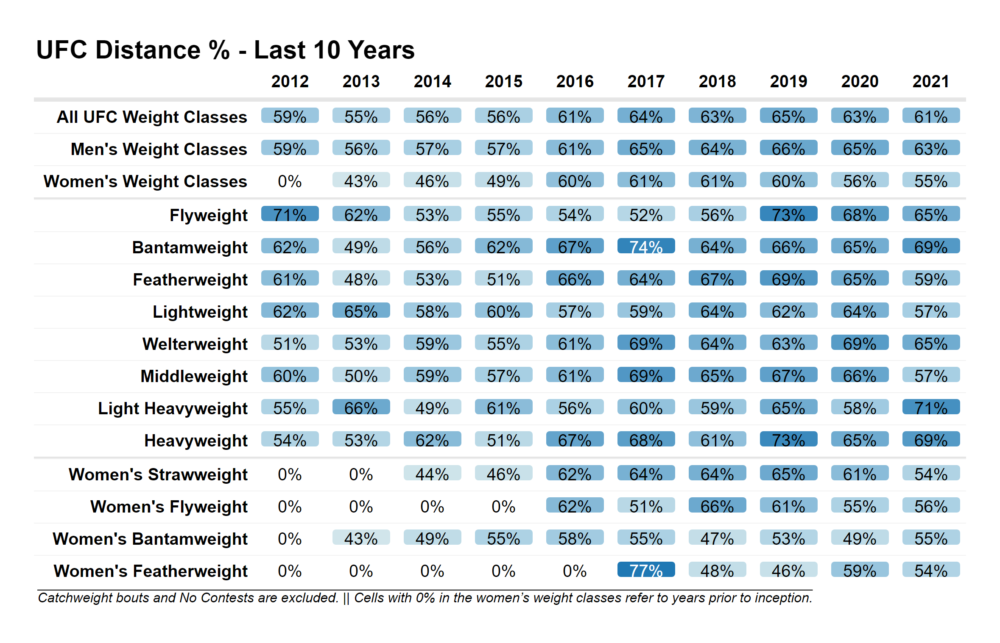

```{r setup, include=FALSE}
knitr::opts_chunk$set(echo = FALSE)
```

```{r, include = F}
rm(list = ls())
gc()

library(data.table)
library(lubridate)
library(ggplot2)
library(RColorBrewer)
library(scales)
library(kableExtra)
library(reactablefmtr)
library(webshot2)
library(ggrepel)

data_path <- '../../_supplemential_files/2022-01-05-visualizing-fighter-styles/input_files/'

seed <- 123

# plot aesthetics
paired_colors4 <- brewer.pal(6, 'Paired')[c(6,2,5,1)]

# load data
rounds <- readRDS(paste0(data_path, 'round_stats_20220106.RDS'))
fights <- readRDS(paste0(data_path, 'fight_stats_20220106.RDS'))

# create variables
min_year <- fights[, year(min(EventDate))]
max_year <- fights[, year(max(EventDate))]
num_fights <- fights[year(EventDate) %in% min_year:max_year, format(uniqueN(FightLink), big.mark = ',')]

# create columns
rounds[, Distance_Percent := (FightDur_Min - F1_CtrlMin - F2_CtrlMin) / FightDur_Min]
fights[, Distance_Percent := (FightDur_Min - F1_CtrlMin - F2_CtrlMin) / FightDur_Min]

rounds[, F1_Control_Rate := F1_CtrlMin / (F1_CtrlMin + F2_CtrlMin)]
rounds[is.na(F1_Control_Rate), F1_Control_Rate := 0]

fights[, F1_Control_Rate := F1_CtrlMin / (F1_CtrlMin + F2_CtrlMin)]
fights[is.na(F1_Control_Rate), F1_Control_Rate := 0]

# career stats
careers <- fights[, .(Last_Bout = max(EventDate), 
                      Fight_Minutes = sum(FightDur_Min), 
                      Distance_Minutes = sum(FightDur_Min - F1_CtrlMin - F2_CtrlMin), 
                      ClinchGround_Minutes = sum(F1_CtrlMin + F2_CtrlMin), 
                      Distance_Percent = sum(FightDur_Min - F1_CtrlMin - F2_CtrlMin) / sum(FightDur_Min), 
                      ClinchGround_Pct = sum(F1_CtrlMin + F2_CtrlMin) / sum(FightDur_Min), 
                      Control_Pct = sum(F1_CtrlMin) / sum(FightDur_Min), 
                      Controlled_Pct = sum(F2_CtrlMin) / sum(FightDur_Min), 
                      Control_Rate = sum(F1_CtrlMin) / sum(F1_CtrlMin + F2_CtrlMin)), 
                  by = .(F1_Link, F1_Name)]
careers[is.na(Control_Rate), Control_Rate := 0]

```

# Introduction

Little work has been done publicly to quantify fighter styles in the Ultimate Fighting Championship (UFC). Nevertheless, there are several distinct styles that are apparent to those who follow mixed martial arts (MMA), primarily due to the different disciplines encompassed within the sport.

For instance, UFC fans know that even though Giga Chikadze and Bryce Mitchell are both ranked Featherweights with 14 professional MMA wins who are undefeated in the UFC, their fighting styles are quite different. Chikadze's success comes from elite kickboxing while Mitchell holds a black belt in Brazilian Jiu-Jitsu and largely relies on grappling.

Like most sports, success in MMA can look very different for different athletes. Specialists may rely solely on either striking, wrestling, or grappling, but many in the UFC possess a well-rounded skill set across multiple disciplines. This post begins to explore UFC fighter styles quantitatively and serves as a simple introduction on how publicly available data can be leveraged to better understand stylistic differences between fighters.

# Distance %

Data from [ufcstats.com](http://www.ufcstats.com) partitions each round into time spent either (a) at distance, (b) in the clinch, or (c) on the ground. This post explores how often fighters spend at distance. That is,

```{=tex}
\begin{equation}
\text{Distance %} = \frac{\text{Time spent at distance}}{\text{Total fight time}}
\end{equation}
```

As seen in the figure below, Distance % varies across time and weight class. In general, UFC fighters have spent more time at distance over the latter half of the last decade. However, it is unclear if this trend is due to an evolution of the sport or a change in how the UFC selects prospects to sign. 

As more young athletes are introduced to MMA earlier in life and have more time to train multiple disciplines, we might expect professional mixed martial artists to develop more competent striking and takedown defense, which could lead to more time spent at distance. On the other hand, to the extent that larger shares of the UFC fan base enjoy watching fights that predominantly take place on the feet, we might also expect the UFC to be more inclined to sign fighters with striking expertise over those who prefer grappling.

```{r, layout = 'l-body-outset'}
# format data
tbl <- fights[WeightClass_clean != 'Catchweight' & F1_NoContest == F & year(EventDate) %in% 2012:2021, 
              .(DistPct = sum(FightDur_Min - F1_CtrlMin - F2_CtrlMin) / sum(FightDur_Min)), 
              by = .(WeightClass = WeightClass_clean, Year = year(EventDate))][order(Year)]

tbl <- rbind(tbl, 
             fights[WeightClass_clean != 'Catchweight' & F1_NoContest == F & year(EventDate) %in% 2012:2021 & 
                      WeightClass_clean %in% c('Flyweight', 'Bantamweight', 'Featherweight', 'Lightweight', 'Welterweight', 
                                             'Middleweight', 'Light Heavyweight', 'Heavyweight'), 
                    .(DistPct = sum(FightDur_Min - F1_CtrlMin - F2_CtrlMin) / sum(FightDur_Min), 
                      WeightClass = "Men's Weight Classes"), 
                    by = .(Year = year(EventDate))], 
             fights[WeightClass_clean != 'Catchweight' & F1_NoContest == F & year(EventDate) %in% 2012:2021 & 
                      WeightClass_clean %in% c("Women\'s Strawweight", "Women's Flyweight", "Women's Bantamweight", "Women's Featherweight"), 
                    .(DistPct = sum(FightDur_Min - F1_CtrlMin - F2_CtrlMin) / sum(FightDur_Min), 
                      WeightClass = "Women's Weight Classes"), 
                    by = .(Year = year(EventDate))], 
             fights[WeightClass_clean != 'Catchweight' & F1_NoContest == F & year(EventDate) %in% 2012:2021, 
                    .(DistPct = sum(FightDur_Min - F1_CtrlMin - F2_CtrlMin) / sum(FightDur_Min), 
                        WeightClass = 'All UFC Weight Classes'), 
                    by = .(Year = year(EventDate))])

tbl[, WeightClass := factor(WeightClass, levels = c('All UFC Weight Classes', "Men's Weight Classes", "Women's Weight Classes", 
                                                    'Flyweight', 'Bantamweight', 'Featherweight', 'Lightweight', 'Welterweight', 
                                                    'Middleweight', 'Light Heavyweight', 'Heavyweight', "Women\'s Strawweight", 
                                                    "Women's Flyweight", "Women's Bantamweight", "Women's Featherweight"))]

tbl <- dcast(tbl, WeightClass ~ Year, value.var = 'DistPct')
tbl[is.na(tbl)] <- 0

# build table
formatted_tbl <- reactable(
  tbl,
  pagination = F, 
  striped = F, 
  style = list(fontSize = '20px', 
               fontWeight = 'bold', 
               fontFamily = 'Arial'), 
  rowStyle = function(index){
    if (tbl[index, WeightClass] == "Women's Weight Classes") list(borderBottom = '2px solid rgba(0, 0, 0, .1)')
    else if (tbl[index, WeightClass] == "All UFC Weight Classes") list(borderTop = '3px solid rgba(0, 0, 0, .1)')
    else if (tbl[index, WeightClass] == "Heavyweight") list(borderBottom = '2px solid rgba(0, 0, 0, .1)')
  }, 
  defaultColDef = colDef(
    cell = color_tiles(tbl, span = T, colors = c('white', 'azure1', 'azure2', paired_colors4[c(4,2)]), brighten_text = T, number_fmt = percent), 
    align = 'center', 
    minWidth = 84, 
    maxWidth = 84
  ), 
  columns = list(
    'WeightClass' = colDef(name = '', 
                           align = 'right', 
                           minWidth = 260, 
                           maxWidth = 260)
  )
) %>% 
  add_title('UFC Distance % - Last 10 Years', margin = 2, font_family = 'Arial', font_size = 30) %>% 
  add_source(source = 'Catchweight bouts and No Contests are excluded. || Cells with 0% in the women\'s weight classes refer to years prior to inception.', 
             font_family = 'Arial', 
             font_style = 'italic', 
             font_size = 16, 
             text_decoration = 'overline')

save_reactable(formatted_tbl, './img/ufc_distance_pct_over_time.png', vwidth = 1200)



```

```{r}
# create data.table for histogram of career distance %
plot_df <- careers[year(Last_Bout) >= 2019 & Fight_Minutes >= 10]

median_distance_percent <- plot_df[, median(Distance_Percent)]
distance_percent_p33 <- plot_df[, as.numeric(quantile(Distance_Percent, probs = 1/3))]
distance_percent_p67 <- plot_df[, as.numeric(quantile(Distance_Percent, probs = 2/3))]
```

The figure below shows the career Distance % distribution for modern UFC fighters. With a median of `r paste0(format(100 * round(median_distance_percent, 3), nsmall = 1), '%')`, the majority of fighters spend more than half of their careers at distance. If we partition the Distance % distribution into three equally-sized groups, as denoted by the dashed vertical lines in the figure below, we can place fighters into the following groups based on where their fights tend to take place:

1. Wrestling/Grappling Heavy = the 33% of fighters who spent the smallest % of their UFC career at distance (i.e. Distance % < `r paste0(format(100 * round(distance_percent_p33, 3), nsmall = 1), '%')`), which means this group contains the 33% of fighters who spent the largest % of their career wrestling/grappling
2. Balanced = the middle 33% of fighters in terms of UFC career Distance % (i.e. Distance % between `r paste0(format(100 * round(distance_percent_p33, 3), nsmall = 1), '%')` and `r paste0(format(100 * round(distance_percent_p67, 3), nsmall = 1), '%')`)
3. Distance Striking Heavy = the 33% of fighters who spent the largest % of their UFC career at distance (i.e. Distance % > `r paste0(format(100 * round(distance_percent_p67, 3), nsmall = 1), '%')`)

```{r, layout = 'l-body-outset'}
# histogram of career distance %
ggplot(plot_df, aes(x = Distance_Percent)) + 
  geom_histogram(binwidth = .05, boundary = 0, closed = 'left') + 
  scale_x_continuous(breaks = seq(0, 1, .1), limits = c(0, 1), label = percent_format(accuracy = 1)) + 
  scale_y_continuous(breaks = seq(0, 100, 25), limits = c(0, 120)) + 
  geom_vline(xintercept = distance_percent_p33, lty = 2) + 
  geom_vline(xintercept = distance_percent_p67, lty = 2) + 
  annotate('text', size = 2.5, label = 'Wrestling/Grappling Heavy\n(lowest 33% of fighters)', 
           x = distance_percent_p33 / 2, 
           y = 115) + 
  annotate('text', size = 2.5, label = 'Balanced', 
           x = distance_percent_p33 + ((distance_percent_p67 - distance_percent_p33) / 2), 
           y = 115) + 
  annotate('text', size = 2.5, label = 'Distance Striking Heavy\n(highest 33% of fighters)', 
           x = distance_percent_p67 + ((1 - distance_percent_p67) / 2), 
           y = 115) + 
  labs(title = 'Distribution of UFC fighter career Distance %', 
       x = '\nDistance %', 
       y = 'Number of fighters\n', 
       caption = '\n-Note: Figure includes UFC fighters who fought at least once since 2019 and have at least 10 minutes of career fight time.') + 
  theme_bw() + 
  theme(text = element_text(size = 9), 
        plot.caption = element_text(hjust = 0, face = 'italic'))

```

Partitioning fighters by Distance % is meaningful because fighters with different backgrounds tend to prefer that their bouts take place at different places. For instance, those with a strong wrestling or Brazilian Jiu-Jitsu pedigree likely prefer to tie up opponents in the clinch and take the bout to the ground, which results in a lower Distance % than many of those with a strong kickboxing or Muay Thai background. While the groups derived from the Distance % distribution are certainly not perfect, they serve as rough approximations for the style of fight that each fighter prefers.

# Control Rate

In addition to grouping fighters based on how often they spend at distance, we can partition fighters based on how dominant they are in the clinch and on the ground. Since even the best strikers in MMA need some wrestling and grappling skills in order to defend takedowns and avoid submissions, forming groups based on a fighter's ability to control opponents in the clinch and on the ground is meaningful. 

In particular, we can use Control Rate to proxy for dominance in these situations. In simple terms, Control Rate is the percent of all clinch and ground time spent in a control position. That is, 

```{=tex}
\begin{equation}
\text{Control Rate} = \frac{\text{Time spent in a clinch or ground control position}}{\text{Total fight time spent in the clinch or on the ground}}
\end{equation}
```

Put another way, 

```{=tex}
\begin{equation}
\text{Control Rate} = \frac{\text{Control time}}{\text{Control time + Controlled time}}
\end{equation}
```

```{r}
# create data.table for histogram of control rate
plot_df <- careers[year(Last_Bout) >= 2019 & ClinchGround_Minutes >= 5]

control_rate_p33 <- plot_df[, as.numeric(quantile(Control_Rate, probs = 1/3))]
control_rate_p67 <- plot_df[, as.numeric(quantile(Control_Rate, probs = 2/3))]
```

The distribution of career Control Rate among modern UFC fighters is shown in the figure below. As we did above with Distance %, if we partition Control Rate into three groups of equal size, via the dashed vertical lines in the figure below, we can create the following groups based on a fighter's ability to control opponents in the clinch and on the ground:

1. Non-Dominant Wrestling/Grappling = the 33% of fighters with the lowest Control Rate (i.e. Control Rate < `r paste0(format(100 * round(control_rate_p33, 3), nsmall = 1), '%')`)
2. Balanced = the middle 33% of fighters in terms of Control Rate (i.e. Control Rate between `r paste0(format(100 * round(control_rate_p33, 3), nsmall = 1), '%')` and `r paste0(format(100 * round(control_rate_p67, 3), nsmall = 1), '%')`)
3. Dominant Wrestling/Grappling = the 33% of fighters with the highest Control Rate (i.e. Control Rate > `r paste0(format(100 * round(control_rate_p67, 3), nsmall = 1), '%')`)

```{r, layout = 'l-body-outset'}
# histogram of career control rate
ggplot(plot_df, aes(x = Control_Rate)) + 
  geom_histogram(binwidth = .05, boundary = 0, closed = 'left') + 
  scale_x_continuous(breaks = seq(0, 1, .1), limits = c(0, 1), label = percent_format(accuracy = 1)) + 
  scale_y_continuous(breaks = seq(0, 70, 20), limits = c(0, 72)) + 
  geom_vline(xintercept = control_rate_p33, lty = 2) + 
  geom_vline(xintercept = control_rate_p67, lty = 2) + 
  annotate('text', size = 2.5, label = 'Non-Dominant Wrestling/Grappling\n(lowest 33% of fighters)', 
           x = control_rate_p33 / 2, 
           y = 66) + 
  annotate('text', size = 2.5, label = 'Balanced', 
           x = control_rate_p33 + ((control_rate_p67 - control_rate_p33) / 2), 
           y = 66) + 
  annotate('text', size = 2.5, label = 'Dominant Wrestling/Grappling\n(highest 33% of fighters)', 
           x = control_rate_p67 + ((1 - control_rate_p67) / 2), 
           y = 66) + 
  labs(title = 'Distribution of UFC fighter career Control Rate', 
       x = '\nControl Rate', 
       y = 'Number of fighters\n', 
       caption = '\n-Note: Figure includes UFC fighters who fought at least once since 2019 and have at least 5 minutes of career clinch/ground time.') + 
  theme_bw() + 
  theme(text = element_text(size = 9), 
        plot.caption = element_text(hjust = 0, face = 'italic'))

```

Control Rate is an imperfect measure of clinch and ground dominance since, for instance, some fighters are still capable of submitting opponents with their backs against the ground in a non-control position. Nevertheless, Control Rate generally serves as a reasonable proxy for wrestling and grappling skill for most fighters.

# Fighter Styles

Combining Distance % and Control Rate allows us to place UFC fighters into broad, stylistic categories. The figure below illustrates the following four categories:

A: Wrestling/Grappling Heavy with Dominant Wrestling/Grappling. These fighters tend to prefer fights involving a lot of wrestling and grappling, and they tend to be very successful when they are able to close the distance on their opponents and/or take them down to the ground.

B: Distance Striking Heavy with Dominant Wrestling/Grappling. These fighters tend to prefer bouts spent predominantly at distance, and they spend little time in the clinch or on the ground because they generally possess either strong takedown defense or a strong wrestling/grappling pedigree such that their opponents would rather stand and strike with them than try to take them down.

C: Wrestling/Grappling Heavy with Non-Dominant Wrestling/Grappling. These fighters tend to be unable to control where their fights take place. They spend a lot of time in the clinch and on the ground in non-control positions likely because of poor takedown defense and/or subpar grappling skills.

D: Distance Striking Heavy with Non-Dominant Wrestling/Grappling. These fighters tend to prefer bouts that take place on the feet. Given their high Distance % coupled with their lack of wrestling/grappling success, these fighters likely possess and rely on a strong takedown defense to be successful and get into trouble when taken down by their opponents.

These categories are certainly imperfect, and there are likely many exceptions within each category. Further, fighters often change categories throughout their careers as their skills and tendencies (and that of their opponents) evolve. However, in general, these categories tend to reasonably depict the stylistic categories of many UFC fighters.

```{r, layout = 'l-body-outset'}
ggplot(careers, aes(x = Distance_Percent, y = Control_Rate)) + 
  geom_segment(x = 0, y = 0, xend = 0, yend = 1, color = 'azure2') + 
  geom_segment(x = 0.1, y = 0, xend = 0.1, yend = 1, color = 'azure2') + 
  geom_segment(x = 0.2, y = 0, xend = 0.2, yend = 1, color = 'azure2') + 
  geom_segment(x = 0.3, y = 0, xend = 0.3, yend = 1, color = 'azure2') + 
  geom_segment(x = 0.4, y = 0, xend = 0.4, yend = 1, color = 'azure2') + 
  geom_segment(x = 0.5, y = 0, xend = 0.5, yend = 1, color = 'azure2') + 
  geom_segment(x = 0.6, y = 0, xend = 0.6, yend = 1, color = 'azure2') + 
  geom_segment(x = 0.7, y = 0, xend = 0.7, yend = 1, color = 'azure2') + 
  geom_segment(x = 0.8, y = 0, xend = 0.8, yend = 1, color = 'azure2') + 
  geom_segment(x = 0.9, y = 0, xend = 0.9, yend = 1, color = 'azure2') + 
  geom_segment(x = 0, y = 0, xend = 1, yend = 0, color = 'azure2') + 
  geom_segment(x = 0, y = 0.1, xend = 1, yend = 0.1, color = 'azure2') + 
  geom_segment(x = 0, y = 0.2, xend = 1, yend = 0.2, color = 'azure2') + 
  geom_segment(x = 0, y = 0.3, xend = 1, yend = 0.3, color = 'azure2') + 
  geom_segment(x = 0, y = 0.4, xend = 1, yend = 0.4, color = 'azure2') + 
  geom_segment(x = 0, y = 0.5, xend = 1, yend = 0.5, color = 'azure2') + 
  geom_segment(x = 0, y = 0.6, xend = 1, yend = 0.6, color = 'azure2') + 
  geom_segment(x = 0, y = 0.7, xend = 1, yend = 0.7, color = 'azure2') + 
  geom_segment(x = 0, y = 0.8, xend = 1, yend = 0.8, color = 'azure2') + 
  geom_segment(x = 0, y = 0.9, xend = 1, yend = 0.9, color = 'azure2') + 
  geom_hline(yintercept = control_rate_p33, lty = 2, alpha = .6) + 
  geom_hline(yintercept = control_rate_p67, lty = 2, alpha = .6) + 
  geom_vline(xintercept = distance_percent_p33, lty = 2, alpha = .6) + 
  geom_vline(xintercept = distance_percent_p67, lty = 2, alpha = .6) + 
  scale_x_continuous(breaks = seq(0, 1, .1), limits = c(0, 1.08), labels = percent_format(accuracy = 1), expand = c(0.002, 0.002)) + 
  scale_y_continuous(breaks = seq(0, 1, .1), limits = c(0, 1.06), labels = percent_format(accuracy = 1), expand = c(0.002, 0.002)) + 
  annotate('text', label = 'Distance Striking Heavy', x = distance_percent_p67 + ((1 - distance_percent_p67) / 2), y = 1.03, size = 2.5) + 
  annotate('text', label = 'Balanced', x = distance_percent_p33 + ((distance_percent_p67 - distance_percent_p33) / 2), y = 1.03, size = 2.5) + 
  annotate('text', label = 'Wrestling/Grappling Heavy', x = distance_percent_p33 / 2, y = 1.03, size = 2.5) + 
  annotate('text', label = 'Dominant\nWrestling/Grappling', x = 1.05, y = control_rate_p67 + ((1 - control_rate_p67) / 2), size = 2.5, angle = 270) + 
  annotate('text', label = 'Balanced', x = 1.05, y = control_rate_p33 + ((control_rate_p67 - control_rate_p33) / 2), size = 2.5, angle = 270) + 
  annotate('text', label = 'Non-Dominant\nWrestling/Grappling', x = 1.05, y = control_rate_p33 / 2, size = 2.5, angle = 270) + 
  annotate('rect', xmin = 0, xmax = distance_percent_p33, ymin = control_rate_p67, ymax = 1, fill = 'gray60', alpha = .4) + 
  annotate('rect', xmin = distance_percent_p67, xmax = 1, ymin = control_rate_p67, ymax = 1, fill = 'gray60', alpha = .4) + 
  annotate('rect', xmin = 0, xmax = distance_percent_p33, ymin = 0, ymax = control_rate_p33, fill = 'gray60', alpha = .4) + 
  annotate('rect', xmin = distance_percent_p67, xmax = 1, ymin = 0, ymax = control_rate_p33, fill = 'gray60', alpha = .4) + 
  annotate('text', label = 'A', x = distance_percent_p33 / 2, y = control_rate_p67 + ((1 - control_rate_p67) / 2), size = 6) + 
  annotate('text', label = 'B', size = 6, 
           x = distance_percent_p67 + ((1 - distance_percent_p67) / 2), 
           y = control_rate_p67 + ((1 - control_rate_p67) / 2)) + 
  annotate('text', label = 'C', x = distance_percent_p33 / 2, y = (1 - control_rate_p67) / 2, size = 6) + 
  annotate('text', label = 'D', size = 6, 
           x = distance_percent_p67 + ((1 - distance_percent_p67) / 2), 
           y = control_rate_p33 / 2) + 
  labs(title = 'Categories of UFC Fighter Styles', 
       x = '\nDistance %', 
       y = 'Control Rate\n') + 
  theme_minimal() + 
  theme(panel.grid = element_blank(), 
        text = element_text(size = 9), 
        plot.caption = element_text(hjust = 0, face = 'italic'))
```

# Styles of Notable UFC Fighters

The figure below shows a few notable fighters from each of the aforementioned stylistic categories. In general, these categories describe these fighters' styles well.

The fighters at the top left of the figure are known for their suffocating wrestling or grappling. Those at the top right typically prefer to stand and strike, and they have the capacity to keep the fight where they want with their strong wrestling or Brazilian Jiu-Jitsu pedigree. At the bottom right are fighters that are highly skilled at striking and can generally keep the fight at distance, but when they are taken down, they tend to struggle. Finally, at the bottom left are fighters that are controlled by their opponents often.

```{r, layout = 'l-body-outset'}
fnames <- c('Merab Dvalishvili', 'Bryce Mitchell', 'Curtis Blaydes', 'Islam Makhachev', 
            'Justin Gaethje', 'Pedro Munhoz', 'TJ Dillashaw', 'Henry Cejudo', 
            'Kevin Holland', 'Charles Rosa', 'Darren Stewart', 'John Phillips', 
            'Giga Chikadze', 'Edson Barboza', 'Stephen Thompson', 'Paulo Costa')

ggplot(careers[F1_Name %in% fnames], aes(x = Distance_Percent, y = Control_Rate)) + 
  geom_segment(x = 0, y = 0, xend = 0, yend = 1, color = 'azure2') + 
  geom_segment(x = 0.1, y = 0, xend = 0.1, yend = 1, color = 'azure2') + 
  geom_segment(x = 0.2, y = 0, xend = 0.2, yend = 1, color = 'azure2') + 
  geom_segment(x = 0.3, y = 0, xend = 0.3, yend = 1, color = 'azure2') + 
  geom_segment(x = 0.4, y = 0, xend = 0.4, yend = 1, color = 'azure2') + 
  geom_segment(x = 0.5, y = 0, xend = 0.5, yend = 1, color = 'azure2') + 
  geom_segment(x = 0.6, y = 0, xend = 0.6, yend = 1, color = 'azure2') + 
  geom_segment(x = 0.7, y = 0, xend = 0.7, yend = 1, color = 'azure2') + 
  geom_segment(x = 0.8, y = 0, xend = 0.8, yend = 1, color = 'azure2') + 
  geom_segment(x = 0.9, y = 0, xend = 0.9, yend = 1, color = 'azure2') + 
  geom_segment(x = 0, y = 0, xend = 1, yend = 0, color = 'azure2') + 
  geom_segment(x = 0, y = 0.1, xend = 1, yend = 0.1, color = 'azure2') + 
  geom_segment(x = 0, y = 0.2, xend = 1, yend = 0.2, color = 'azure2') + 
  geom_segment(x = 0, y = 0.3, xend = 1, yend = 0.3, color = 'azure2') + 
  geom_segment(x = 0, y = 0.4, xend = 1, yend = 0.4, color = 'azure2') + 
  geom_segment(x = 0, y = 0.5, xend = 1, yend = 0.5, color = 'azure2') + 
  geom_segment(x = 0, y = 0.6, xend = 1, yend = 0.6, color = 'azure2') + 
  geom_segment(x = 0, y = 0.7, xend = 1, yend = 0.7, color = 'azure2') + 
  geom_segment(x = 0, y = 0.8, xend = 1, yend = 0.8, color = 'azure2') + 
  geom_segment(x = 0, y = 0.9, xend = 1, yend = 0.9, color = 'azure2') + 
  geom_hline(yintercept = control_rate_p33, lty = 2, alpha = .6) + 
  geom_hline(yintercept = control_rate_p67, lty = 2, alpha = .6) + 
  geom_vline(xintercept = distance_percent_p33, lty = 2, alpha = .6) + 
  geom_vline(xintercept = distance_percent_p67, lty = 2, alpha = .6) + 
  scale_x_continuous(breaks = seq(0, 1, .1), limits = c(0, 1.08), labels = percent_format(accuracy = 1), expand = c(0.002, 0.002)) + 
  scale_y_continuous(breaks = seq(0, 1, .1), limits = c(0, 1.06), labels = percent_format(accuracy = 1), expand = c(0.002, 0.002)) + 
  annotate('text', label = 'Distance Striking Heavy', x = distance_percent_p67 + ((1 - distance_percent_p67) / 2), y = 1.03, size = 2.5) + 
  annotate('text', label = 'Balanced', x = distance_percent_p33 + ((distance_percent_p67 - distance_percent_p33) / 2), y = 1.03, size = 2.5) + 
  annotate('text', label = 'Wrestling/Grappling Heavy', x = distance_percent_p33 / 2, y = 1.03, size = 2.5) + 
  annotate('text', label = 'Dominant\nWrestling/Grappling', x = 1.05, y = control_rate_p67 + ((1 - control_rate_p67) / 2), size = 2.5, angle = 270) + 
  annotate('text', label = 'Balanced', x = 1.05, y = control_rate_p33 + ((control_rate_p67 - control_rate_p33) / 2), size = 2.5, angle = 270) + 
  annotate('text', label = 'Non-Dominant\nWrestling/Grappling', x = 1.05, y = control_rate_p33 / 2, size = 2.5, angle = 270) + 
  annotate('rect', xmin = 0, xmax = distance_percent_p33, ymin = control_rate_p67, ymax = 1, fill = 'gray60', alpha = .4) + 
  annotate('rect', xmin = distance_percent_p67, xmax = 1, ymin = control_rate_p67, ymax = 1, fill = 'gray60', alpha = .4) + 
  annotate('rect', xmin = 0, xmax = distance_percent_p33, ymin = 0, ymax = control_rate_p33, fill = 'gray60', alpha = .4) + 
  annotate('rect', xmin = distance_percent_p67, xmax = 1, ymin = 0, ymax = control_rate_p33, fill = 'gray60', alpha = .4) + 
  labs(title = 'Styles of Notable UFC Fighters', 
       subtitle = 'January 5, 2022', 
       x = '\nDistance %', 
       y = 'Control Rate\n') + 
  geom_point(size = 3.5) + 
  geom_label_repel(aes(label = F1_Name), box.padding = 0.5, xlim = c(0, 1), ylim = c(0, 1), seed = seed, size = 2) + 
  theme_minimal() + 
  theme(panel.grid = element_blank(), 
        text = element_text(size = 9), 
        plot.caption = element_text(hjust = 0, face = 'italic'))
```

# UFC Men's Pound-for-Pound Top 10

The styles of the current top 10 pound-for-pound fighters in the UFC are shown in the figure below. 

Note that even the best mixed martial artists in the world are not dominant in all areas of the sport. Israel Adesanya and Francis Ngannou, two current UFC champions, each have a Control Rate that is less than 15%. Their success comes from striking, and their precision and power at distance tends to offset any potential deficiencies they may have elsewhere.

Interestingly, even though the UFC is trending toward more distance striking over the last few years, only 4 of the top 10 would be considered Distance Striking Heavy fighters. Hence, despite this trend, it still certainly pays to develop wrestling and grappling skills in modern MMA, which should come as no surprise.

```{r, layout = 'l-body-outset', preview = T}
fnames <- c('Kamaru Usman', 'Alexander Volkanovski', 'Israel Adesanya', 'Francis Ngannou', 'Charles Oliveira', 'Jon Jones', 
            'Max Holloway', 'Dustin Poirier', 'Stipe Miocic', 'Brandon Moreno')

ggplot(careers[F1_Name %in% fnames], aes(x = Distance_Percent, y = Control_Rate)) + 
  geom_segment(x = 0, y = 0, xend = 0, yend = 1, color = 'azure2') + 
  geom_segment(x = 0.1, y = 0, xend = 0.1, yend = 1, color = 'azure2') + 
  geom_segment(x = 0.2, y = 0, xend = 0.2, yend = 1, color = 'azure2') + 
  geom_segment(x = 0.3, y = 0, xend = 0.3, yend = 1, color = 'azure2') + 
  geom_segment(x = 0.4, y = 0, xend = 0.4, yend = 1, color = 'azure2') + 
  geom_segment(x = 0.5, y = 0, xend = 0.5, yend = 1, color = 'azure2') + 
  geom_segment(x = 0.6, y = 0, xend = 0.6, yend = 1, color = 'azure2') + 
  geom_segment(x = 0.7, y = 0, xend = 0.7, yend = 1, color = 'azure2') + 
  geom_segment(x = 0.8, y = 0, xend = 0.8, yend = 1, color = 'azure2') + 
  geom_segment(x = 0.9, y = 0, xend = 0.9, yend = 1, color = 'azure2') + 
  geom_segment(x = 0, y = 0, xend = 1, yend = 0, color = 'azure2') + 
  geom_segment(x = 0, y = 0.1, xend = 1, yend = 0.1, color = 'azure2') + 
  geom_segment(x = 0, y = 0.2, xend = 1, yend = 0.2, color = 'azure2') + 
  geom_segment(x = 0, y = 0.3, xend = 1, yend = 0.3, color = 'azure2') + 
  geom_segment(x = 0, y = 0.4, xend = 1, yend = 0.4, color = 'azure2') + 
  geom_segment(x = 0, y = 0.5, xend = 1, yend = 0.5, color = 'azure2') + 
  geom_segment(x = 0, y = 0.6, xend = 1, yend = 0.6, color = 'azure2') + 
  geom_segment(x = 0, y = 0.7, xend = 1, yend = 0.7, color = 'azure2') + 
  geom_segment(x = 0, y = 0.8, xend = 1, yend = 0.8, color = 'azure2') + 
  geom_segment(x = 0, y = 0.9, xend = 1, yend = 0.9, color = 'azure2') + 
  geom_hline(yintercept = control_rate_p33, lty = 2, alpha = .6) + 
  geom_hline(yintercept = control_rate_p67, lty = 2, alpha = .6) + 
  geom_vline(xintercept = distance_percent_p33, lty = 2, alpha = .6) + 
  geom_vline(xintercept = distance_percent_p67, lty = 2, alpha = .6) + 
  scale_x_continuous(breaks = seq(0, 1, .1), limits = c(0, 1.08), labels = percent_format(accuracy = 1), expand = c(0.002, 0.002)) + 
  scale_y_continuous(breaks = seq(0, 1, .1), limits = c(0, 1.06), labels = percent_format(accuracy = 1), expand = c(0.002, 0.002)) + 
  annotate('text', label = 'Distance Striking Heavy', x = distance_percent_p67 + ((1 - distance_percent_p67) / 2), y = 1.03, size = 2.5) + 
  annotate('text', label = 'Balanced', x = distance_percent_p33 + ((distance_percent_p67 - distance_percent_p33) / 2), y = 1.03, size = 2.5) + 
  annotate('text', label = 'Wrestling/Grappling Heavy', x = distance_percent_p33 / 2, y = 1.03, size = 2.5) + 
  annotate('text', label = 'Dominant\nWrestling/Grappling', x = 1.05, y = control_rate_p67 + ((1 - control_rate_p67) / 2), size = 2.5, angle = 270) + 
  annotate('text', label = 'Balanced', x = 1.05, y = control_rate_p33 + ((control_rate_p67 - control_rate_p33) / 2), size = 2.5, angle = 270) + 
  annotate('text', label = 'Non-Dominant\nWrestling/Grappling', x = 1.05, y = control_rate_p33 / 2, size = 2.5, angle = 270) + 
  annotate('rect', xmin = 0, xmax = distance_percent_p33, ymin = control_rate_p67, ymax = 1, fill = 'gray60', alpha = .4) + 
  annotate('rect', xmin = distance_percent_p67, xmax = 1, ymin = control_rate_p67, ymax = 1, fill = 'gray60', alpha = .4) + 
  annotate('rect', xmin = 0, xmax = distance_percent_p33, ymin = 0, ymax = control_rate_p33, fill = 'gray60', alpha = .4) + 
  annotate('rect', xmin = distance_percent_p67, xmax = 1, ymin = 0, ymax = control_rate_p33, fill = 'gray60', alpha = .4) + 
  labs(title = 'Fighter Styles of the UFC Men\'s Pound-for-Pound Top 10', 
       subtitle = 'January 5, 2022', 
       x = '\nDistance %', 
       y = 'Control Rate\n') + 
  geom_point(size = 3.5) + 
  geom_label_repel(aes(label = F1_Name), box.padding = 0.5, xlim = c(0, 1), ylim = c(0, 1), seed = seed, size = 2) + 
  theme_minimal() + 
  theme(panel.grid = element_blank(), 
        text = element_text(size = 9), 
        plot.caption = element_text(hjust = 0, face = 'italic'))
```

# Next Steps

This post serves as a first, exploratory step toward quantitatively defining and visualizing fighter styles along two dimensions, Distance % and Control Rate. Be sure to connect with me on [Twitter](https://twitter.com/NateLatshaw) if you have any questions or comments, or if you would like to see how these types of figures evolve, as I will likely be sharing these on there going forward.

The relatively simple styles discussed throughout leave a lot to be desired, and there are several sensible paths forward that can increase the complexity and (hopefully) the value of the styles created. Some of the other potential metrics to consider in the future include distance striking pace, distance striking differential, takedown pace, takedown accuracy, and takedown defense. Each of these metrics attempts to quantify a fighter's striking, wrestling, or grappling aptitude. Finally, an unsupervised learning, or clustering, approach may help identify more complicated and more informative styles across more dimensions than can be visualized on a plot.


